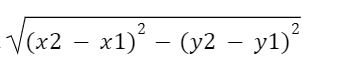

# DISTANCE-BETWEEN-TWO-POINTS

## AIM:
To write a python program to find the distance two 2 points
## ALGORITHM:
### Step 1: 
using import math function, do the calculations.
### Step 2: 
Take the two coordinates as l1 and l2
### Step 3: 
Substitute the values in the distance formula  


### Step 4: 
Using the print function, display the distance between the two points.
### Step 5: 
End the program.

### PROGRAM:
```
import math
l1 = [4,2]
l2 = [10,6]
distance = math.sqrt(((l2[0]-l1[0])**2)+((l2[1]-l1[1])**2))
print("{:.2f}".format(distance))
```


### OUTPUT:


### RESULT:
Thus, the distance between two points is successfully executed and displayed.
